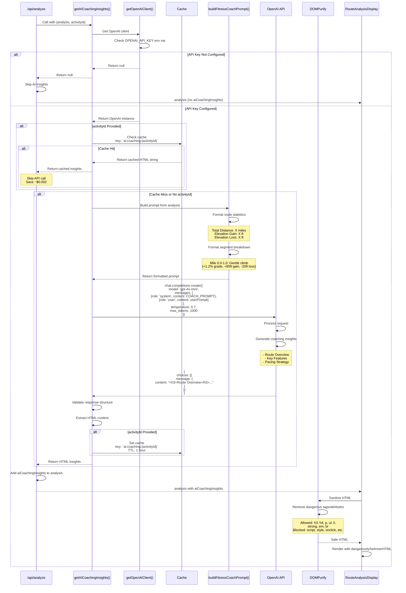

# AI Coaching Insights Generation Flow

This diagram shows how AI coaching insights are generated using OpenAI.



## Prompt Engineering

### System Prompt
Defines the AI as an experienced fitness coach who:
- Analyzes running routes
- Provides practical, actionable advice
- Uses conversational, supportive tone
- Formats output as semantic HTML

### User Prompt Structure
```
Route Statistics:
- Total Distance: 5.23 miles
- Total Elevation Gain: 450 feet
- Total Elevation Loss: 420 feet

Mile-by-Mile Breakdown:
  Mile 0.0-1.0: Relatively flat (+0.2% grade, +12ft gain, -8ft loss)
  Mile 1.0-2.0: Gentle climb (+1.5% grade, +95ft gain, -15ft loss)
  ...

Based on this data, provide analysis with:
- Route Overview
- Key Features
- Pacing & Effort Strategy
```

### Expected Response Format
```html
<h3>Route Overview</h3>
<p>This is a moderately hilly 5.2-mile route...</p>

<h3>Key Features</h3>
<ul>
  <li>Mostly flat start for the first 1.5 miles</li>
  <li>Significant climbing from mile 2 to 3.5</li>
  <li>Recovery descent in final mile</li>
</ul>

<h3>Pacing & Effort Strategy</h3>
<p>Start conservatively on the flat opening miles...</p>
```

## Model Configuration

| Parameter | Value | Purpose |
|-----------|-------|---------|
| model | gpt-4o-mini | Cost-effective, fast |
| temperature | 0.7 | Balance creativity & consistency |
| max_tokens | 1000 | ~750 words max |

## Cost Analysis

### Per Request
- **Input**: ~400-600 tokens (route data + prompt)
- **Output**: ~600-800 tokens (coaching insights)
- **Total Cost**: $0.001 - $0.003 per analysis

### With Caching
- **First request**: $0.001 - $0.003
- **Cached requests**: $0 (within 1 hour)
- **Typical savings**: 50-80% with cache hit rate

## HTML Sanitization

### Allowed Tags
```typescript
ALLOWED_TAGS: [
  'h3', 'h4',           // Headers
  'p',                   // Paragraphs
  'ul', 'ol', 'li',     // Lists
  'strong', 'em',       // Emphasis
  'br'                   // Line breaks
]
```

### Security
- All attributes removed (no onclick, style, etc.)
- Script tags blocked
- External links removed
- XSS prevention

## Error Handling

### API Key Missing
```typescript
console.warn('OpenAI API key not configured');
return null;  // Analysis continues without AI insights
```

### API Error
```typescript
catch (error) {
  console.error('Error getting AI insights:', error);
  return null;  // Analysis continues without AI insights
}
```

### Invalid Response
```typescript
if (!completion.choices || completion.choices.length === 0) {
  console.error('OpenAI returned no completion choices');
  return null;
}
```

## Related Diagrams

- [Route Analysis Flow](./route-analysis-flow.md) - When AI is called
- [API Request Overview](./api-request-overview.md) - Integration point
