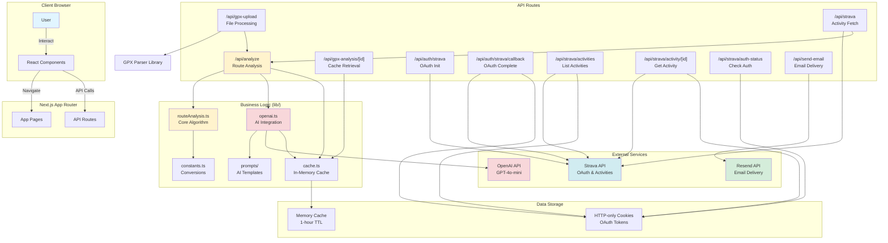

# API Request Overview - Architecture

This diagram shows the high-level API architecture and request routing.



## API Endpoint Categories

### Core Analysis
- **POST /api/analyze** - Main analysis endpoint
  - Input: RoutePoint[]
  - Output: RouteAnalysis with AI insights
  - Uses: routeAnalysis.ts, openai.ts, cache.ts

### GPX Processing
- **POST /api/gpx-upload** - Parse GPX file
  - Input: FormData with GPX file
  - Output: RoutePoint[]
  - Uses: gpx-parser-builder library
- **GET /api/gpx-analysis/[gpxId]** - Retrieve cached analysis
  - Input: UUID from upload
  - Output: Cached analysis data
  - Uses: cache.ts

### Strava Integration
- **GET /api/auth/strava** - OAuth initiation
- **GET /api/auth/strava/callback** - OAuth completion
- **POST /api/strava** - Fetch activity by URL
- **GET /api/strava/activities** - List user activities
- **GET /api/strava/activity/[id]** - Get specific activity
- **GET /api/strava/auth-status** - Check authentication

### Email Delivery
- **POST /api/send-email** - Send HTML email report
  - Input: email, analysis, images
  - Output: Success confirmation
  - Uses: Resend API

## Request Flow Patterns

### Synchronous Request
```
Client → API Route → Business Logic → External API → Response
```

### With Caching
```
Client → API Route → Check Cache → [Hit: Return] [Miss: Process → Cache → Return]
```

### OAuth Flow
```
Client → Init → Strava → Callback → Store Tokens → Redirect
```

## Authentication Patterns

### Strava Routes
```typescript
// Check cookies for tokens
const accessToken = request.cookies.get('strava_access_token')?.value;

// Auto-refresh if expired
if (now >= expiresAt) {
  // Use refresh token to get new access token
}
```

### OpenAI Routes
```typescript
// Server-side only
const apiKey = process.env.OPENAI_API_KEY;
```

### Resend Routes
```typescript
// Server-side only
const apiKey = process.env.RESEND_API_KEY;
```

## Caching Strategy

### Cache Keys
- `gpx:{uuid}` - GPX analysis (1 hour)
- `ai:coaching:{activityId}` - AI insights (1 hour)

### Cache Implementation
- In-memory Map
- TTL-based expiration
- No persistence (lost on restart)
- Per-instance (not distributed)

## Error Handling Patterns

### Validation Errors (400)
```json
{ "error": "Invalid input message" }
```

### Authentication Errors (401)
```json
{
  "error": "Not authenticated",
  "authRequired": true,
  "authUrl": "/api/auth/strava"
}
```

### Server Errors (500)
```json
{
  "error": "Failed to process request",
  "details": "Error details (optional)"
}
```

## Related Diagrams

- [GPX Upload Flow](./gpx-upload-flow.md) - Complete upload flow
- [Strava Activity Flow](./strava-activity-flow.md) - Strava integration
- [Route Analysis Flow](./route-analysis-flow.md) - Analysis algorithm
