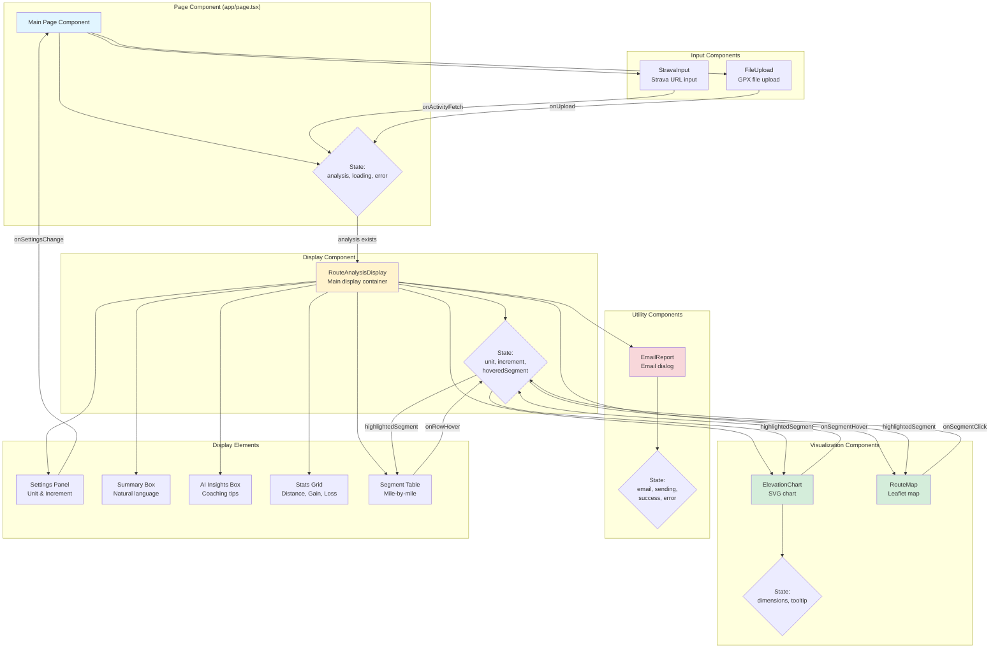

# Component Architecture and Data Flow

This diagram shows the React component hierarchy and data flow patterns.



## Component Responsibilities

### Main Page (app/page.tsx)
**State:**
- `analysis: RouteAnalysis | null`
- `loading: boolean`
- `error: string | null`

**Responsibilities:**
- Render input components
- Fetch route data (GPX or Strava)
- Call /api/analyze
- Pass analysis to display component
- Handle re-analysis on settings change

### StravaInput
**Props:**
- `onActivityFetch: (points, activityInfo) => void`

**State:**
- `url: string`
- `loading: boolean`
- `error: string | null`
- `authStatus: { authenticated, configured }`

**Responsibilities:**
- Check Strava auth status on mount
- Display auth UI (login link or status)
- Fetch activity data from /api/strava
- Call onActivityFetch with results

### FileUpload
**Props:**
- `onUpload: (points, activityInfo?, isGpxUpload?) => void`

**State:**
- `uploading: boolean`
- `error: string | null`

**Responsibilities:**
- Handle file selection (click or drag-drop)
- Validate .gpx extension
- Upload to /api/gpx-upload
- Call onUpload with points

### RouteAnalysisDisplay
**Props:**
- `analysis: RouteAnalysis`
- `onSettingsChange?: (unit, increment) => void`

**State:**
- `unit: DistanceUnit` (persisted to localStorage)
- `increment: SegmentIncrement` (persisted to localStorage)
- `manualHoveredSegmentIndex: number | null`
- `hoveredPoint: RoutePoint | null`

**Refs:**
- `mapContainerRef: RefObject<HTMLDivElement>`
- `chartContainerRef: RefObject<HTMLDivElement>`

**Responsibilities:**
- Display all analysis sections
- Manage settings (unit, increment)
- Coordinate segment highlighting across components
- Provide refs for email capture

### ElevationChart
**Props:**
- `segments: RouteSegment[]`
- `points?: RoutePoint[]`
- `unit: DistanceUnit`
- `onSegmentHover?: (index | null) => void`
- `highlightedSegmentIndex?: number | null`

**State:**
- `dimensions: { width, height }`
- `tooltip: { visible, x, y, content } | null`

**Responsibilities:**
- Render SVG elevation profile
- Handle window resize
- Show tooltip on hover
- Call onSegmentHover
- Highlight segments based on prop

### RouteMap
**Props:**
- `points: RoutePoint[]`
- `highlightedSegmentIndex?: number | null`
- `segments?: RouteSegment[]`
- `unit?: DistanceUnit`
- `onSegmentClick?: (index) => void`

**Responsibilities:**
- Render Leaflet map (dynamically imported)
- Show route polyline
- Add start/finish markers
- Add segment markers
- Handle segment clicks
- Highlight segments
- Provide captureMap function for email

### EmailReport
**Props:**
- `analysis: RouteAnalysis`
- `mapContainerRef: RefObject`
- `chartContainerRef: RefObject`

**State:**
- `isOpen: boolean`
- `email: string`
- `sending: boolean`
- `success: boolean`
- `error: string | null`

**Responsibilities:**
- Show email dialog
- Capture map image (leaflet-image)
- Capture chart image (html2canvas)
- Send to /api/send-email
- Show success/error states

## Data Flow Patterns

### 1. Initial Load
```
User → Select Input Method → Fetch Data → Analyze → Display
```

### 2. Settings Change
```
User → Change Unit/Increment → Trigger Re-analyze → Update Display
```

### 3. Segment Highlighting
```
User Hover → Update State → Notify All Components → Synchronized Highlight
```

### 4. Email Report
```
User Click → Open Dialog → Capture Images → Send Email → Show Confirmation
```

## State Management

### Local Component State
- Form inputs (email, URL)
- UI states (loading, error)
- Interaction states (hover, tooltip)

### Lifted State
- `analysis` - Managed by Main Page
- `unit`, `increment` - Managed by RouteAnalysisDisplay

### Persisted State
- `unit` - localStorage
- `increment` - localStorage
- Strava tokens - httpOnly cookies

### Derived State
- Sanitized AI HTML (from DOMPurify)
- Chart dimensions (from resize)
- Map bounds (from points)

## Props Drilling

```
MainPage
  ├─ analysis (passed to RouteAnalysisDisplay)
  │   ├─ segments (passed to ElevationChart)
  │   ├─ points (passed to RouteMap, ElevationChart)
  │   └─ analysis (passed to EmailReport)
  └─ onSettingsChange (callback from RouteAnalysisDisplay)
```

## Event Flow

### Segment Hover
```
Table Row Hover
  → setManualHoveredSegmentIndex(index)
  → highlightedSegmentIndex prop updates
  → ElevationChart highlights segment
  → RouteMap highlights segment
```

### Chart Hover
```
Chart Segment Hover
  → onSegmentHover(index)
  → setManualHoveredSegmentIndex(index)
  → Table row highlights
  → RouteMap highlights segment
```

## Performance Considerations

### Dynamic Import
```typescript
const RouteMap = dynamic(() => import('./RouteMap'), {
  ssr: false  // Leaflet requires window object
});
```

### Memoization Opportunities
- Chart path calculation
- Filtered points
- Sanitized HTML

### Re-render Triggers
- Settings change → Full re-analysis
- Hover change → Only highlighted components
- Window resize → Only chart dimensions

## Related Diagrams

- [GPX Upload Flow](./gpx-upload-flow.md) - FileUpload interaction
- [Strava Activity Flow](./strava-activity-flow.md) - StravaInput interaction
- [Email Report Flow](./email-report-flow.md) - EmailReport interaction
- [Map Chart Interaction](./map-chart-interaction.md) - Segment highlighting details
