# Email Report Flow - User Experience

This diagram shows how users send email reports with route analysis.

```mermaid
sequenceDiagram
    actor User
    participant Browser
    participant EmailReport as EmailReport Component
    participant RouteMap
    participant ElevationChart
    participant html2canvas
    participant leafletImage
    participant EmailAPI as /api/send-email
    participant Resend

    User->>Browser: Click "Email Report" button
    Browser->>EmailReport: Open dialog
    EmailReport->>Browser: Show email input
    
    User->>EmailReport: Enter email address
    User->>EmailReport: Click "Send"
    
    EmailReport->>EmailReport: Validate email format
    EmailReport->>Browser: Show "Capturing images..." state
    
    par Capture Map and Chart
        EmailReport->>RouteMap: Request map capture
        RouteMap->>leafletImage: leafletImage(mapRef.current)
        leafletImage->>leafletImage: Render map to canvas
        leafletImage-->>RouteMap: Canvas element
        RouteMap->>RouteMap: canvas.toDataURL('image/png')
        RouteMap-->>EmailReport: Base64 PNG string
    and
        EmailReport->>ElevationChart: Access chart container ref
        EmailReport->>html2canvas: html2canvas(chartContainer, {...})
        html2canvas->>html2canvas: Render DOM to canvas (scale: 2)
        html2canvas-->>EmailReport: Canvas element
        EmailReport->>EmailReport: canvas.toDataURL('image/png')
    end
    
    EmailReport->>EmailReport: Validate images captured
    EmailReport->>Browser: Show "Sending..." state
    
    EmailReport->>EmailAPI: POST /api/send-email<br/>{ email, analysis, mapImage, chartImage }
    
    EmailAPI->>EmailAPI: Check RESEND_API_KEY configured
    EmailAPI->>EmailAPI: Validate email address
    EmailAPI->>EmailAPI: Log image data lengths
    
    EmailAPI->>EmailAPI: Generate HTML email
    Note over EmailAPI: Email includes:<br/>- Route summary<br/>- AI insights (if available)<br/>- Stats grid (distance, gain, loss)<br/>- Embedded chart image<br/>- Embedded map image<br/>- Segment table<br/>- Footer
    
    EmailAPI->>Resend: resend.emails.send({<br/>  from: 'Route Analyzer <onboarding@resend.dev>',<br/>  to: [email],<br/>  subject: 'Route Analysis - X.XX mi',<br/>  html: htmlContent<br/>})
    
    Resend->>Resend: Queue email for delivery
    Resend->>Resend: Send email to recipient
    Resend-->>EmailAPI: { id: 'email-id-123' }
    
    EmailAPI-->>EmailReport: { success: true, emailId: '...' }
    
    EmailReport->>Browser: Show success message
    Browser-->>User: "✓ Email sent successfully!"
    
    EmailReport->>EmailReport: Auto-close after 3 seconds
    
    Note over User,Resend: Email arrives in inbox<br/>with embedded images
```

## Key Features

1. **Dual Image Capture**: Map and chart captured in parallel
2. **High Resolution**: Chart rendered at 2x scale for quality
3. **Base64 Embedding**: Images embedded directly in HTML email
4. **Validation**: Email format and image data validated
5. **Professional Template**: Styled HTML with inline CSS
6. **Auto-close**: Dialog closes 3 seconds after success

## Image Capture Details

### Map Capture (leaflet-image)
- Captures current map view
- Includes all markers and polylines
- Output: PNG data URL
- Typical size: 100-200 KB

### Chart Capture (html2canvas)
- Renders entire chart container
- Scale factor: 2 for retina quality
- White background
- Typical size: 50-100 KB

## Email Template Structure

1. **Header**: "Route Analysis Report" with description
2. **Summary Box**: Natural language terrain summary (blue box)
3. **AI Insights**: HTML coaching insights (purple gradient box) - optional
4. **Stats Grid**: 3-column grid (distance, gain, loss)
5. **Chart**: Full-width elevation profile image
6. **Map**: Full-width route map image
7. **Table**: Segment-by-segment breakdown with color-coded grades
8. **Footer**: Attribution and static snapshot notice

## Error Handling

- **Invalid email**: "Please enter a valid email address"
- **Image capture failed**: "Failed to capture images"
- **API not configured**: Shows setup instructions
- **Send failed**: Displays error from Resend
- **Network error**: Generic "Failed to send email" message

## Email Deliverability

- **Sender**: onboarding@resend.dev (Resend test domain)
- **Rate Limit**: 100 emails/day on free tier
- **Compatibility**: Works with Gmail, Outlook, Apple Mail
- **Spam Filters**: Proper headers and verified sender

## Related Diagrams

- [Component Architecture](./component-architecture.md) - Component hierarchy
- [API Request Overview](./api-request-overview.md) - API endpoints
