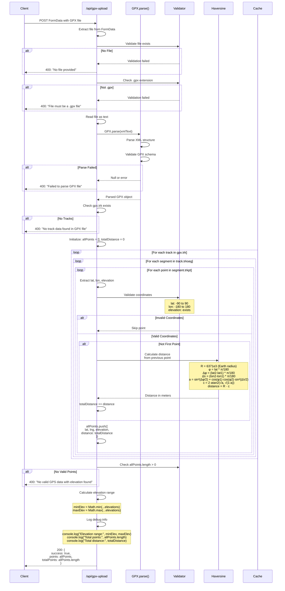

# GPX File Processing - Detailed Flow

This diagram shows the detailed GPX file parsing and validation process.



## GPX XML Structure

### Standard Format
```xml
<?xml version="1.0"?>
<gpx version="1.1" creator="GPS Device">
  <metadata>
    <name>Morning Run</name>
    <time>2024-11-01T08:00:00Z</time>
  </metadata>
  <trk>
    <name>Track 1</name>
    <trkseg>
      <trkpt lat="37.7749" lon="-122.4194">
        <ele>100.5</ele>
        <time>2024-11-01T08:00:00Z</time>
      </trkpt>
      <trkpt lat="37.7750" lon="-122.4195">
        <ele>102.3</ele>
        <time>2024-11-01T08:00:15Z</time>
      </trkpt>
      <!-- More points... -->
    </trkseg>
  </trk>
</gpx>
```

## Haversine Formula Breakdown

### Purpose
Calculate great-circle distance between two GPS coordinates on Earth's surface.

### Variables
- `R` = Earth's radius (6,371,000 meters)
- `φ1, φ2` = Latitude in radians
- `λ1, λ2` = Longitude in radians
- `Δφ` = Difference in latitude
- `Δλ` = Difference in longitude

### Formula
```
a = sin²(Δφ/2) + cos(φ1) · cos(φ2) · sin²(Δλ/2)
c = 2 · atan2(√a, √(1-a))
distance = R · c
```

### Accuracy
- Error: ~0.5% for typical running distances
- Assumes spherical Earth
- Good enough for route analysis

## Validation Rules

### File Level
- Must exist in FormData
- Must have `.gpx` extension
- Must be valid XML

### Structure Level
- Must have `<gpx>` root element
- Must have at least one `<trk>` (track)
- Track must have at least one `<trkseg>` (segment)
- Segment must have at least one `<trkpt>` (point)

### Point Level
- Must have `lat` attribute (-90 to 90)
- Must have `lon` attribute (-180 to 180)
- Must have `<ele>` child element (elevation)
- All values must be valid numbers

## Data Extraction

### From XML Attributes
```typescript
const lat = parseFloat(point.$.lat);
const lng = parseFloat(point.$.lon);
```

### From XML Child Elements
```typescript
const elevation = parseFloat(point.ele);
```

### Optional Fields (Ignored)
- `<time>` - Timestamp
- `<name>` - Point name
- `<desc>` - Description
- `<extensions>` - Custom data

## Error Recovery

### Skip Invalid Points
```typescript
if (isNaN(lat) || isNaN(lng)) continue;
if (elevation === undefined || isNaN(elevation)) continue;
```

### Continue Processing
- Invalid points are skipped
- Processing continues with next point
- Only fails if no valid points found

## Performance

### Typical Files
- Points: 500-2000
- Processing time: 50-200ms
- Memory: 1-5 MB

### Large Files
- Points: 5000+
- Processing time: 200-500ms
- Memory: 5-20 MB

### Optimization Opportunities
- Stream parsing for huge files
- Worker thread for parsing
- Point decimation for very dense data

## Common GPX Sources

### Compatible
✅ Garmin devices (.gpx export)  
✅ Suunto watches (.gpx export)  
✅ Polar devices (.gpx export)  
✅ Strava (activity export)  
✅ RunKeeper (activity export)  
✅ MapMyRun (activity export)  

### Issues
⚠️ Some apps export without elevation  
⚠️ Route files vs track files (different structure)  
⚠️ Older GPX 1.0 format may have differences  

## Related Diagrams

- [GPX Upload Flow](./gpx-upload-flow.md) - Complete user flow
- [Route Analysis Flow](./route-analysis-flow.md) - What happens with points
