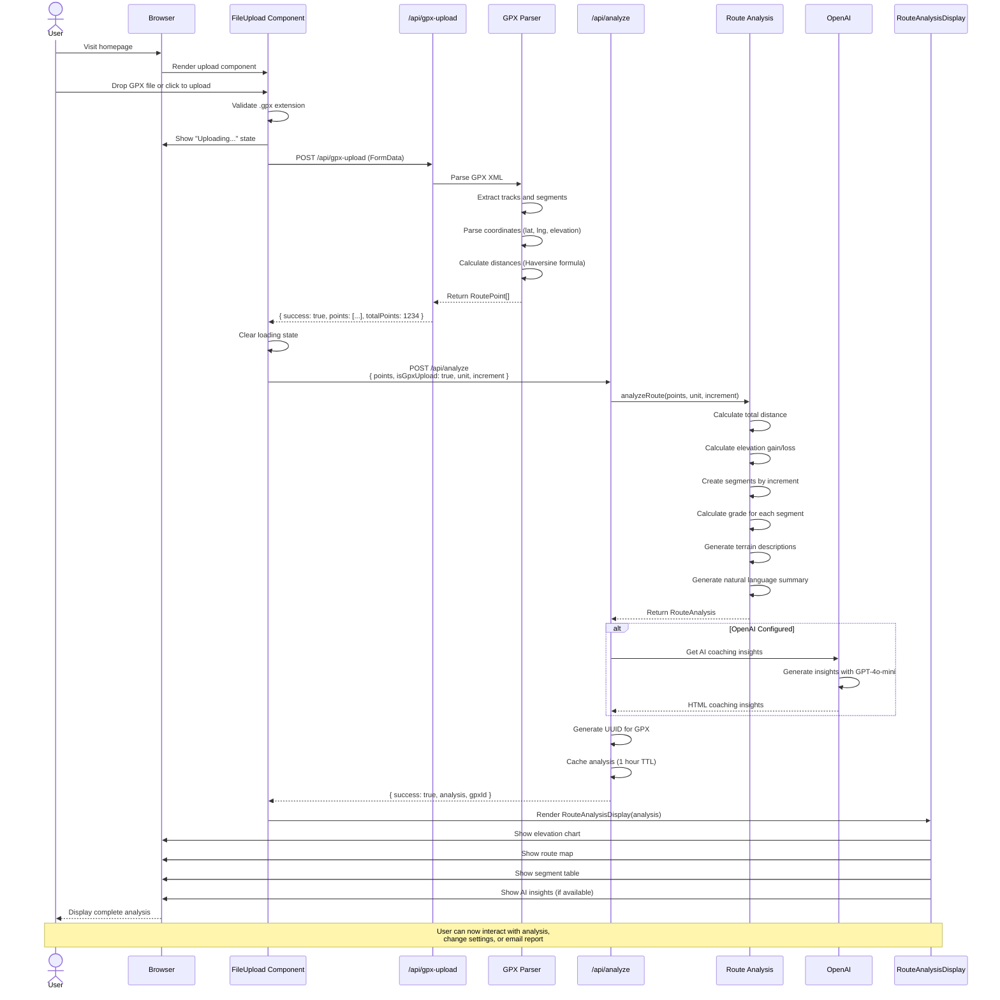

# GPX Upload Flow - User Experience

This diagram shows the complete user experience flow when uploading and analyzing a GPX file.

## Key Points

1. **File Validation**: Extension checked before upload
2. **GPS Parsing**: Haversine formula calculates accurate distances
3. **Analysis**: O(n) algorithm segments route efficiently
4. **Caching**: GPX analysis cached for 1 hour with UUID
5. **AI Optional**: Insights only generated if API key configured
6. **Interactive**: Analysis immediately interactive after rendering

## Error Handling

- Invalid file type → Error message shown
- Parse failure → "Failed to parse GPX file"
- No elevation data → "No valid GPS data with elevation found"
- API error → Generic error message with retry option

## Related Diagrams

- [Route Analysis Flow](./route-analysis-flow.md) - Detailed analysis algorithm
- [GPX Processing](./gpx-processing-flow.md) - GPX parsing details
- [Component Architecture](./component-architecture.md) - Component hierarchy
