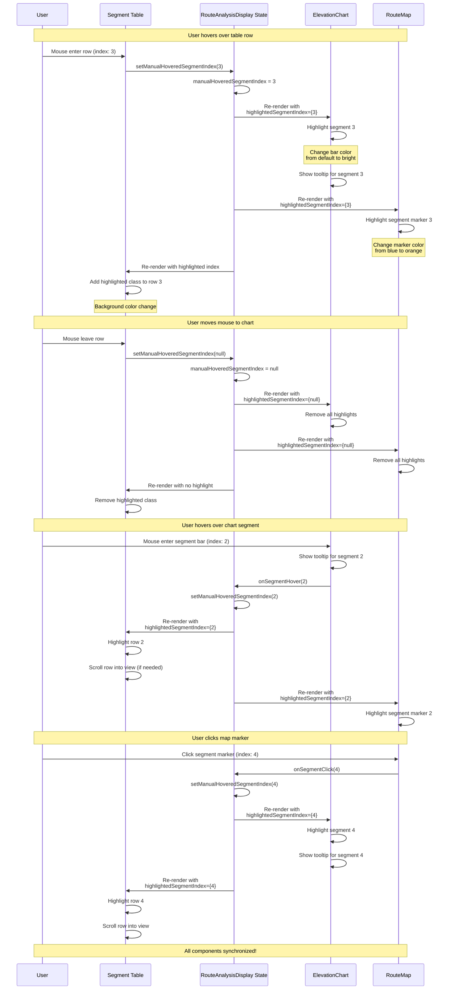
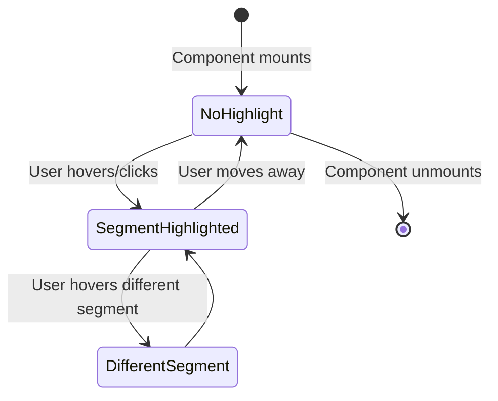

# Map and Chart Interaction - Segment Highlighting

This diagram shows how segment highlighting is synchronized across the map, chart, and table.



## State Management

### Central State
```typescript
const [manualHoveredSegmentIndex, setManualHoveredSegmentIndex] = 
  useState<number | null>(null);
```

### Computed State
```typescript
const hoveredSegmentIndex = manualHoveredSegmentIndex;
```

### Prop Flow
```
RouteAnalysisDisplay
  ├─ highlightedSegmentIndex → ElevationChart
  ├─ highlightedSegmentIndex → RouteMap
  └─ highlightedSegmentIndex → SegmentTable (internal)
```

## Event Handlers

### Table Row Hover
```typescript
<tr 
  onMouseEnter={() => setManualHoveredSegmentIndex(index)}
  onMouseLeave={() => setManualHoveredSegmentIndex(null)}
  className={hoveredSegmentIndex === index ? 'bg-blue-100' : ''}
>
```

### Chart Segment Hover
```typescript
<ElevationChart
  onSegmentHover={(index) => setManualHoveredSegmentIndex(index)}
  highlightedSegmentIndex={hoveredSegmentIndex}
/>
```

### Map Marker Click
```typescript
<RouteMap
  onSegmentClick={(index) => setManualHoveredSegmentIndex(index)}
  highlightedSegmentIndex={hoveredSegmentIndex}
/>
```

## Visual Feedback

### Table
**Normal:**
```css
background: white (light mode)
background: gray-900 (dark mode)
```

**Highlighted:**
```css
background: blue-100 (light mode)
background: blue-900 (dark mode)
```

### Chart
**Normal:**
```css
fill: blue-500
opacity: 0.6
```

**Highlighted:**
```css
fill: blue-600
opacity: 1.0
stroke: blue-700
stroke-width: 2
```

### Map
**Normal Marker:**
```css
background: blue-500
color: white
border-radius: 50%
```

**Highlighted Marker:**
```css
background: orange-500
color: white
border-radius: 50%
transform: scale(1.2)
```

## Interaction Patterns

### Pattern 1: Explore by Table
```
User scans table
  → Hovers row
  → Sees location on map
  → Sees elevation on chart
  → Understands terrain
```

### Pattern 2: Explore by Chart
```
User examines chart
  → Hovers elevation peak
  → Sees mile marker in table
  → Sees location on map
  → Understands context
```

### Pattern 3: Explore by Map
```
User views route
  → Clicks segment marker
  → Sees details in table
  → Sees elevation in chart
  → Understands challenge
```

## Performance Considerations

### Re-render Optimization
```typescript
// Only highlighted components re-render
// Use React.memo for expensive components
const ElevationChart = React.memo(({ highlightedSegmentIndex, ... }) => {
  // Only re-renders when highlightedSegmentIndex changes
});
```

### Debouncing Hover
```typescript
// Optional: Debounce rapid hover events
const debouncedHover = useMemo(
  () => debounce(setManualHoveredSegmentIndex, 50),
  []
);
```

### Scroll Performance
```typescript
// Use scrollIntoView with smooth behavior
if (tableRef.current) {
  tableRef.current.rows[index].scrollIntoView({
    behavior: 'smooth',
    block: 'nearest'
  });
}
```

## Accessibility

### Keyboard Navigation
```typescript
// Arrow keys navigate segments
onKeyDown={(e) => {
  if (e.key === 'ArrowDown') {
    setManualHoveredSegmentIndex(Math.min(index + 1, maxIndex));
  }
  if (e.key === 'ArrowUp') {
    setManualHoveredSegmentIndex(Math.max(index - 1, 0));
  }
}}
```

### Screen Reader
```html
<tr 
  aria-selected={hoveredSegmentIndex === index}
  role="row"
>
  <td>Mile {segment.startMile} - {segment.endMile}</td>
</tr>
```

### Focus Management
```typescript
// Focus highlighted element
useEffect(() => {
  if (hoveredSegmentIndex !== null && tableRef.current) {
    const row = tableRef.current.rows[hoveredSegmentIndex];
    row?.focus();
  }
}, [hoveredSegmentIndex]);
```

## Touch Device Support

### Touch Events
```typescript
// Support tap on mobile
<div
  onClick={() => setManualHoveredSegmentIndex(index)}
  onTouchStart={() => setManualHoveredSegmentIndex(index)}
>
```

### Tap vs Scroll
```typescript
// Distinguish tap from scroll
let touchStartY = 0;
onTouchStart={(e) => {
  touchStartY = e.touches[0].clientY;
}}
onTouchEnd={(e) => {
  const touchEndY = e.changedTouches[0].clientY;
  if (Math.abs(touchEndY - touchStartY) < 10) {
    // This was a tap, not a scroll
    setManualHoveredSegmentIndex(index);
  }
}}
```

## State Transitions



## Related Diagrams

- [Component Architecture](./component-architecture.md) - Overall component structure
- [GPX Upload Flow](./gpx-upload-flow.md) - When components first render
- [Strava Activity Flow](./strava-activity-flow.md) - When components first render
