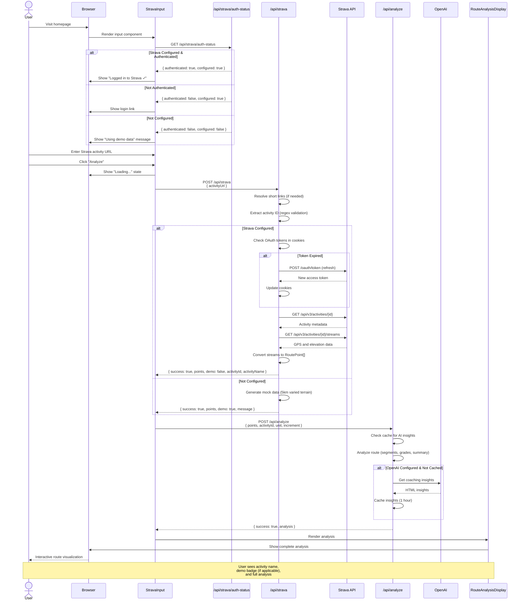

# Strava Activity Flow - User Experience

This diagram shows the complete flow when a user analyzes a Strava activity.

## Key Features

1. **Auth Check**: Status checked on component mount
2. **Demo Mode**: Works without Strava credentials
3. **Token Refresh**: Automatic refresh of expired tokens
4. **Short Links**: Resolves strava.app.link URLs
5. **Caching**: AI insights cached by activity ID
6. **Real Data**: Full GPS and elevation from Strava streams

## Authentication States

- **Authenticated**: Full access to real activity data
- **Not Authenticated**: Redirect to OAuth or use demo data
- **Token Expired**: Auto-refresh with refresh token
- **Not Configured**: Demo mode with realistic mock data

## Error Scenarios

- Invalid URL → "Invalid Strava activity URL"
- Auth required → Show login link with auth URL
- Token refresh failed → Prompt re-authentication
- Private activity → Strava API returns 401
- Rate limit → Strava API returns 429

## Related Diagrams

- [Strava OAuth Flow](./strava-oauth-flow.md) - Authentication process
- [Strava Data Flow](./strava-data-flow.md) - API interaction details
- [Route Analysis Flow](./route-analysis-flow.md) - Analysis algorithm
