# Strava Data Fetching - Detailed Flow

This diagram shows the detailed Strava API interaction including token management.

```mermaid
sequenceDiagram
    participant Client
    participant API as /api/strava
    participant URLResolver
    participant Cookies
    participant TokenRefresh
    participant Strava as Strava API
    participant StreamConverter

    Client->>API: POST { activityUrl }
    API->>API: Validate activityUrl exists
    
    API->>URLResolver: resolveUrl(activityUrl)
    
    alt Short Link (strava.app.link)
        URLResolver->>URLResolver: Validate domain
        URLResolver->>URLResolver: Set 5-second timeout
        URLResolver->>Strava: Follow redirect (with timeout)
        Strava-->>URLResolver: Location header with full URL
        URLResolver->>URLResolver: Validate resolved domain
        Note over URLResolver: Only allow:<br/>- strava.com<br/>- www.strava.com<br/>- *.strava.com
        URLResolver-->>API: Resolved URL
    else Regular URL
        URLResolver-->>API: Original URL
    end
    
    API->>API: Extract activity ID
    Note over API: Regex: /activities/(\d+)/<br/>Validates digits only
    
    alt Invalid URL
        API-->>Client: 400: "Invalid Strava activity URL"
    end
    
    API->>API: Check STRAVA_CLIENT_ID & SECRET
    
    alt Not Configured
        API->>API: Generate mock data
        Note over API: 5km route with varied terrain:<br/>- First mile flat<br/>- Middle section climbing<br/>- Final section descending
        API-->>Client: {<br/>  success: true,<br/>  points: mockData,<br/>  demo: true,<br/>  message: "Using demo data..."<br/>}
    else Configured
        API->>Cookies: Get OAuth tokens
        Note over Cookies: strava_access_token<br/>strava_refresh_token<br/>strava_expires_at
        
        alt Not Authenticated
            API-->>Client: 401: {<br/>  error: "Not authenticated",<br/>  authRequired: true,<br/>  authUrl: "/api/auth/strava"<br/>}
        end
        
        API->>API: Check token expiration
        Note over API: now = Date.now() / 1000<br/>if (now >= expiresAt)
        
        alt Token Expired
            API->>TokenRefresh: Refresh access token
            TokenRefresh->>Strava: POST /oauth/token<br/>{<br/>  client_id,<br/>  client_secret,<br/>  refresh_token,<br/>  grant_type: 'refresh_token'<br/>}
            
            alt Refresh Success
                Strava-->>TokenRefresh: {<br/>  access_token,<br/>  refresh_token,<br/>  expires_at<br/>}
                TokenRefresh->>Cookies: Update cookies
                Note over Cookies: New tokens stored<br/>with same security settings
                TokenRefresh-->>API: New access token
            else Refresh Failed
                TokenRefresh-->>API: Error
                API-->>Client: 401: {<br/>  error: "Token refresh failed",<br/>  authRequired: true<br/>}
            end
        end
        
        API->>Strava: GET /api/v3/activities/{activityId}
        Note over API: Headers:<br/>Authorization: Bearer {access_token}
        
        alt Activity Request Failed
            Strava-->>API: 401 Unauthorized
            API-->>Client: 401: "Re-authenticate required"
        end
        
        Strava-->>API: Activity metadata
        Note over API: {<br/>  id, name, distance,<br/>  type, athlete: { id }<br/>}
        
        API->>Strava: GET /api/v3/activities/{activityId}/streams<br/>?keys=latlng,distance,altitude&key_by_type=true
        Note over API: Headers:<br/>Authorization: Bearer {access_token}
        
        Strava-->>API: Stream data
        Note over API: {<br/>  latlng: { data: [[lat,lng],...] },<br/>  distance: { data: [meters,...] },<br/>  altitude: { data: [meters,...] }<br/>}
        
        API->>StreamConverter: Convert to RoutePoint[]
        
        StreamConverter->>StreamConverter: Get array lengths
        Note over StreamConverter: length = min(<br/>  latlng.length,<br/>  distance.length,<br/>  altitude.length<br/>)
        
        loop For each point (0 to length)
            StreamConverter->>StreamConverter: Create RoutePoint
            Note over StreamConverter: {<br/>  lat: latlng[i][0],<br/>  lng: latlng[i][1],<br/>  elevation: altitude[i],<br/>  distance: distance[i]<br/>}
        end
        
        StreamConverter-->>API: RoutePoint[]
        
        API->>API: Build response
        API-->>Client: {<br/>  success: true,<br/>  points: RoutePoint[],<br/>  demo: false,<br/>  activityId,<br/>  activityName,<br/>  athleteId<br/>}
        
        alt Token Was Refreshed
            API->>Client: Set-Cookie headers<br/>with new tokens
        end
    end
```



## URL Resolution Security

### SSRF Protection
```typescript
// Domain whitelist
const allowedDomains = [
  'strava.app.link',     // Short links
  'strava.com',          // Main domain
  'www.strava.com',      // WWW subdomain
  '*.strava.com'         // Other subdomains
];

// Timeout protection
const controller = new AbortController();
setTimeout(() => controller.abort(), 5000);
```

### Validation Steps
1. Parse URL to validate format
2. Check hostname against whitelist
3. Set timeout for redirect following
4. Validate resolved URL domain
5. Extract and validate activity ID (digits only)

## Token Refresh Logic

### When to Refresh
```typescript
const expiresAt = parseInt(cookies.get('strava_expires_at'));
const now = Math.floor(Date.now() / 1000);

if (now >= expiresAt) {
  // Token expired, refresh it
}
```

### Refresh Request
```http
POST https://www.strava.com/oauth/token
Content-Type: application/json

{
  "client_id": "...",
  "client_secret": "...",
  "refresh_token": "...",
  "grant_type": "refresh_token"
}
```

### Refresh Response
```json
{
  "access_token": "new_token",
  "refresh_token": "new_refresh_token",
  "expires_at": 1699999999,
  "expires_in": 21600
}
```

### Cookie Updates
```typescript
response.cookies.set('strava_access_token', newToken, {
  httpOnly: true,
  secure: true,
  sameSite: 'lax',
  maxAge: 60 * 60 * 6  // 6 hours
});
```

## Strava API Endpoints Used

### Activity Details
```
GET /api/v3/activities/{id}
Response: { id, name, distance, type, athlete, start_date, ... }
```

### Activity Streams
```
GET /api/v3/activities/{id}/streams?keys=latlng,distance,altitude&key_by_type=true
Response: {
  latlng: { data: [[lat,lng], ...] },
  distance: { data: [meters, ...] },
  altitude: { data: [meters, ...] }
}
```

## Stream Data Conversion

### Input Format
```json
{
  "latlng": {
    "data": [
      [37.7749, -122.4194],
      [37.7750, -122.4195]
    ]
  },
  "distance": {
    "data": [0, 15.2, 30.5]
  },
  "altitude": {
    "data": [100, 102, 105]
  }
}
```

### Output Format
```typescript
RoutePoint[] = [
  { lat: 37.7749, lng: -122.4194, elevation: 100, distance: 0 },
  { lat: 37.7750, lng: -122.4195, elevation: 102, distance: 15.2 }
]
```

### Array Length Handling
```typescript
const length = Math.min(
  latlng.length,
  distance.length,
  altitude.length
);
// Prevents index out of bounds
```

## Demo Mode

### When Used
- `STRAVA_CLIENT_ID` not configured
- `STRAVA_CLIENT_SECRET` not configured
- Allows testing without Strava account

### Mock Data Characteristics
```typescript
// 5km route with 100 points
totalDistance: 5000 meters
numPoints: 100

// Varied elevation profile
0-1500m: Flat (sinusoidal variation ±5m)
1500-3500m: Climbing (+0.03m/m)
3500-5000m: Descending (-0.02m/m)
```

## Rate Limiting

### Strava Limits
- 600 requests per 15 minutes
- 30,000 requests per day

### App's Mitigation
- Cache activity data (1 hour)
- Cache AI insights (1 hour)
- No polling or background requests

## Error Handling

### 401 Unauthorized
- Access token expired → Trigger refresh
- Refresh failed → Prompt re-authentication
- Activity private → Same 401 error

### 404 Not Found
- Activity doesn't exist
- Activity deleted
- Invalid activity ID

### 429 Rate Limited
- Too many requests
- Wait and retry
- Contact Strava support

### Network Errors
- Timeout → Retry with exponential backoff
- Connection failed → Check internet
- DNS resolution → Check Strava status

## Related Diagrams

- [Strava OAuth Flow](./strava-oauth-flow.md) - Authentication process
- [Strava Activity Flow](./strava-activity-flow.md) - User experience
- [API Request Overview](./api-request-overview.md) - Architecture context
