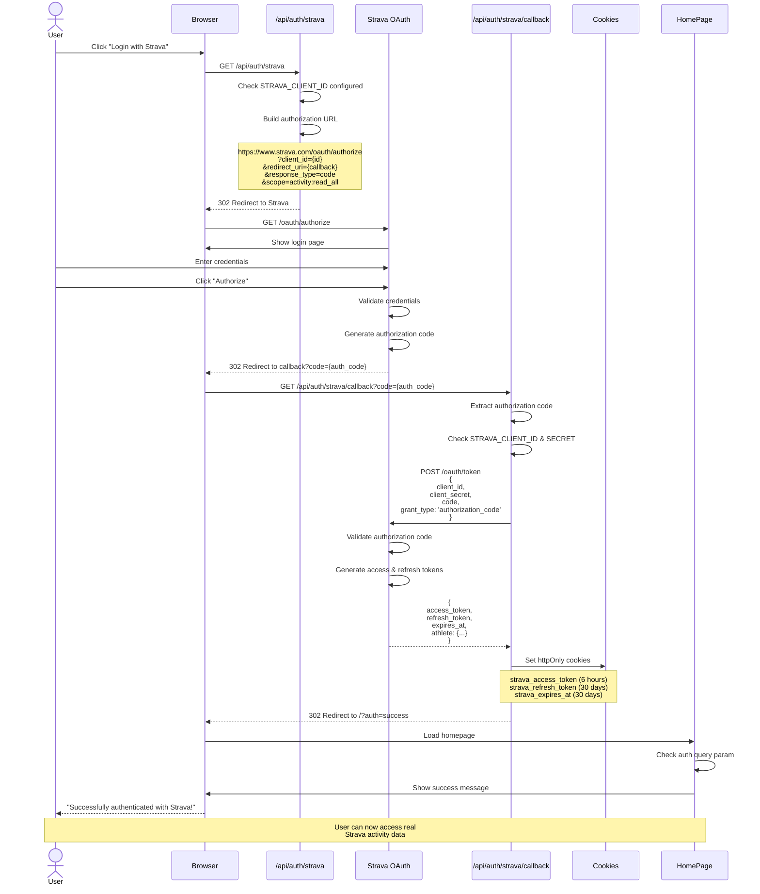

# Strava OAuth 2.0 Authentication Flow

This diagram shows the complete OAuth authentication flow with Strava.



## Security Features

1. **httpOnly Cookies**: Tokens not accessible to JavaScript (XSS protection)
2. **Secure Flag**: HTTPS-only in production
3. **SameSite: lax**: CSRF protection
4. **Token Expiration**: Access token valid 6 hours, refresh token 30 days
5. **Environment Variables**: Client secret never exposed to client

## Token Management

### Access Token
- **Lifetime**: 6 hours
- **Storage**: httpOnly cookie
- **Purpose**: API requests to Strava
- **Renewal**: Auto-refreshed when expired

### Refresh Token
- **Lifetime**: 30 days
- **Storage**: httpOnly cookie
- **Purpose**: Obtain new access tokens
- **Security**: Must re-authenticate after expiration

## OAuth Scopes

- `activity:read_all` - Read all activities including private ones

## Error Scenarios

### User Denies Authorization
```
Strava -->> Browser: Redirect to callback?error=access_denied
Callback -->> Browser: Redirect to /?error=access_denied
```

### Token Exchange Fails
```
Callback -->> Browser: Redirect to /?error=token_exchange_failed
```

### Configuration Error
```
AuthInitiate -->> Browser: { error: "Strava API not configured" }
```

## Cookie Configuration

```typescript
{
  httpOnly: true,           // Not accessible via JavaScript
  secure: NODE_ENV === 'production',  // HTTPS only in prod
  sameSite: 'lax',          // CSRF protection
  maxAge: 60 * 60 * 6       // 6 hours for access token
}
```

## Related Diagrams

- [Strava Activity Flow](./strava-activity-flow.md) - Using authenticated tokens
- [Strava Data Flow](./strava-data-flow.md) - Token refresh mechanism
